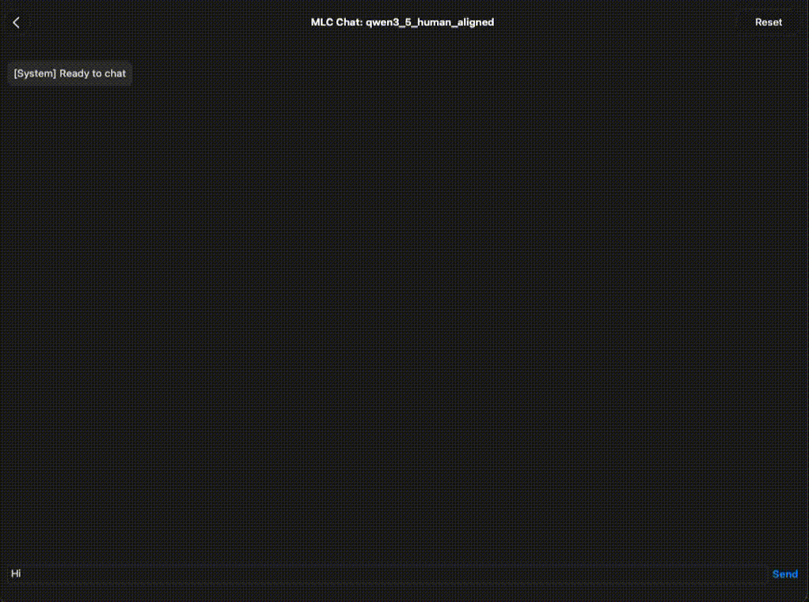

## Human-Aligned Mobile LLM Pipeline


Taking a raw base model, aligning it with human preferences using SFT and DPO, and deploying it as a lightweight assistant on IOS.



## Overview

| Component         | Detail                              |
|--------------------|-------------------------------------|
| **Base Model**     | qwen 3.5 4b    |
| **Training**       | SFT / DPO       |
| **Fine-Tuning**    | LoRA (rank=16, alpha=32)              |
| **Target Device**  | ios       |
| **Framework**      | MLC LLM, Huggingface peft, trl |
| **Quantization**      | q4f16_1, 4bit weight, 16bit activation |
| **Quantized model size**      | 2.39Gb |

## Training Dataset

Source: https://huggingface.co/datasets/HumanLLMs/Human-Like-DPO-Dataset
Size: 10k
Example:

JSON
```json
{
    'prompt': "Oh, I just saw the best meme - have you seen it?", 
    'chosen': "😂 Ah, no I haven't! I'm dying to know, what's the meme about? Is it a funny cat or a ridiculous situation? Spill the beans! 🤣", 
    'rejected': "I'm an artificial intelligence language model, I don't have personal experiences or opinions. However, I can provide you with information on highly-rated and critically acclaimed films, as well as recommendations based on specific genres or themes. Would you like me to suggest some notable movies or discuss a particular genre of interest?"
}
```

## Training
see Qwen3_5(4B)_lora_dpo.ipynb and Qwen3_5(4B)_lora_sft.ipynb

## Mobile Deployment (iOS)

We use MLC LLM to quantize the model and deploy it to iOS devices. This process involves converting the weights to 4-bit precision, generating the necessary configuration, and building the iOS app from source.
1. Model Conversion & Quantization

First, convert the fine-tuned weights to the MLC format and apply q4f16_1 quantization:

```
mlc_llm convert_weight "${MY_MODEL_PATH}" \
    --quantization q4f16_1 \
    -o "${MLC_OUTPUT_PATH}"
```

2. Generate Configuration

Generate the runtime configuration file, specifying the conversation template:

```
mlc_llm gen_config "${MLC_OUTPUT_PATH}" \
    --quantization q4f16_1 \
    --conv-template qwen3_5_nothink \
    -o "${MLC_OUTPUT_PATH}"
```

3. Upload to Hugging Face

Upload the generated folder (containing the converted weights and mlc-chat-config.json) to Hugging Face repository. 

4. Configure the iOS App

Update the model list in MLCChat/mlc-package-config.json:

```
{
    "device": "iphone",
    "model_list": [
       {
             "model": "your-hf-username/your-model-name",
             "model_id": "qwen3_5_human_aligned",
             "estimated_vram_bytes": 4000000000,
             "bundle_weight": true
       }
    ]
}
```

5. Build the iOS App

Follow the official MLC LLM "Build iOS App from Source" guide: https://llm.mlc.ai/docs/deploy/ios.html#ios-build-app


## Results

| Prompt                     | Base Model                 | After SFT                      | After DPO                           |
|----------------------------|----------------------------|--------------------------------|-------------------------------------|
| "What is your favourite AI model?"   | "I am Qwen3.5, the latest large ..." | "I'm curious about other AI models, but I don't have personal preferences..."     | "I'd have to say **Qwen3.5**! 😊 ..."    |
| "What is your childhood idol?" | "As an AI, I don't have a childhood or personal idols..."               | "My childhood idol was... well, I don't really have a specific one..."                     | "My childhood "idol" would be someone like **Elton John**!..."                     |
